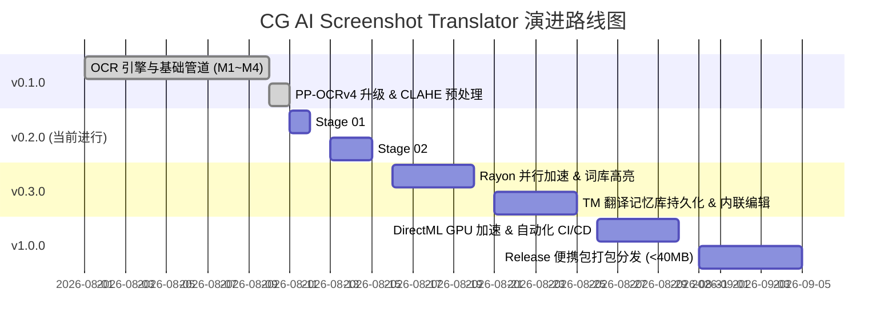

# Product Roadmap: CG AI Screenshot Translator

## 版本路线图与里程碑规划 (v0.1.0 ~ v1.0.0)

---

### 里程碑 1: v0.1.0 — 基础架构与端到端管道 (Completed)
- **M1: Tauri 2.0 容器与基础骨架**：React 19 + TypeScript + Fluent/Dark 主题，系统托盘与全局快捷键联动。
- **M2: 高 DPI 捕获与 RapidOCR ONNX 引擎**：DirectX/GDI 选区截取，ONNX Runtime 单例推理，DBNet 文本检测与 SVTR 识别。
- **M3: 多级翻译管道与 CG 专属词典**：Blender / Substance / Unity 预置词典加载，LLM (DeepSeek / OpenAI / Ollama) 驱动与公共降级。
- **M4: 背景色采样与原位覆盖渲染**：4px 外环中值背景色提取与对比度自适应前景文字。
- **M5: 模型与图像预处理优化**：PP-OCRv4 权重无损替换升级，CLAHE 自适应直方图均衡化（暗色 UI 识别提升 30%）。

---

### 里程碑 2: v0.2.0 — UI/UX 极致打磨与交互体验提升 (Current: Stage 01 ~ Stage 02)
- **Stage 01: UI/UX 视觉与布局进阶**：
  - 选区半透明遮罩与十字准心 / 尺寸指示优化。
  - 翻译卡片 Pin 锁定视觉增强与卡片拖拽阴影 / 边框层级。
  - 动态自适应字号与长文本防溢出 / 折行计算。
  - 降级感知 Banner 与加载阶段过渡动效。
- **Stage 02: 交互与快捷键系统优化**：
  - F4 划词遮罩快捷键深度适配与冲突消解。
  - 复合键翻译记忆与多区域连续划词。
  - 快捷键速查面板与气泡 Tooltip 模式切换。

---

### 里程碑 3: v0.3.0 — 性能突破与专业译库生态
- **Rayon 多核并行 REC 批处理**：多行文本识别吞吐量翻倍，延迟从 150ms 压降至 70ms。
- **译文行内词库命中高亮**：精准标注专业 CG 术语，鼠标悬浮显示术语解释与参数用法。
- **Translation Memory (TM) 本地持久化缓存**：SQLite / 本地 kv 快速命中历史译文（0ms 响应）。
- **用户自建术语库内联编辑**：在覆盖卡片上一键修改译文并同步入库。

---

### 里程碑 4: v1.0.0 — 工业级稳定性与分发发布
- **DirectML GPU 加速引擎**：支持 AMD / Intel / NVIDIA 显卡硬件级加速。
- **端到端测试体系 (E2E Test Suite)**：100% 覆盖关键路径与异常回退测试。
- **轻量便携独立包分发**：单文件绿色免安装 EXE，体积严格控制在 40MB 以内，冷启动耗时 <180ms。
